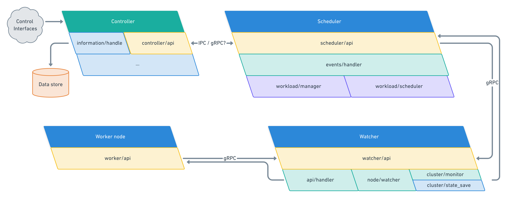
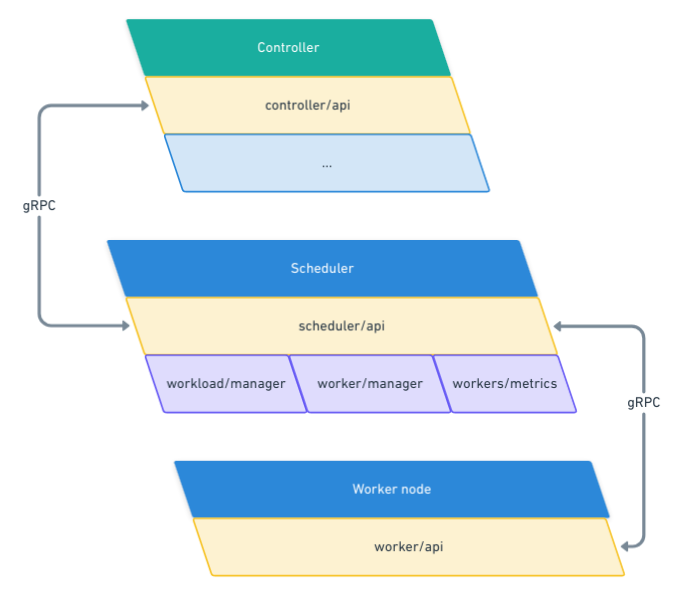

# Scheduler

## Main goal

The `scheduler` goal is to determine whether or not a workload can work on the cluster.
In the case a workload fits to a node, we send severals orders & informations to the node so
he can handle the needed workload. The controller can also determine in a first time, if a workload can be managed in the cluster, but
the scheduler has the **last word** on it. 

This service **must** be able at anytime, to request a delete or an update of a workload on a specific
node. These requests will be sent based on event the scheduler receive. The events are coming either from the controller or from a node.

The `scheduler` is a central point to the whole cluster communication. The service is able to filter
data coming from nodes and lift them up to the controller. By being a central point of communication
the `scheduler` can be considered as a [SPOF](https://en.wikipedia.org/wiki/Single_point_of_failure), 
considering that, this service must be able to recover from a crash **quickly** and **dynamically**.

**Features summary**:

* Allocate a workload to a node
* Request workload update 
* Request workload deletion
* Handle statistics & hardware informations from nodes
* Lift up informations from nodes to controller 
* Handle various events from nodes 

**Glossary:**

* Worker: entity managing workloads and managed by the scheduler & controller
* Workload: a unit of work needed to be deployed inside a worker
* Cluster: the whole architecture containing every single component of this project. 
* Server / Master: a server containing every administrative services (scheduler & controller)

---

## Architecture overview

The `scheduler` domain is composed of two main services, which are composed of multiple components.
The main service is `scheduler` which communicate with the controller to know when to deploy a new
workload, update or delete one. The `watcher` is a service to determine whether or not a worker
is down or still up. It will also receive metrics & events coming from the workers and then redirect
them to the scheduler.

**Scheduler**

*The scheduler handles the whole logic of the scheduler by receiving events from the scheduler API. This API communicate
with either the controller and the watcher.*

Components:

* `scheduler/api`: API which receive and send requests to needed services
* `events/handler`: Depending on the type of API calls received, the event handler will redirect
the information to the proper sub-component.
* `workload/manager`: Process an event related to a workload getting down, to be destroyed or needs to be moved
* `workload/scheduler`: Process controller events needing to schedule a new workload on the cluster

**Watcher**

*The watcher is here to handle requests coming either from scheduler and nodes. It watch after nodes
in order to create events so the scheduler is warned as soon as a node is down.*

Components:

* `watcher/api`: API which receive and send requests to needed services
* `api/handler`: Handle API calls and redirect them properly
* `node/watcher`: Running continuous watch process to know when a node is down
* `cluster/monitor`: Handle API calls relative to statistics and nodes monitoring
* `cluster/state_save`: Save the current state of the cluster 

## Communication in the cluster 

There are mainly two solutions. Either having direct connections between components (HTTP, gRPC...) of the cluster or having
message queues where information is centralized.

The second solution can be a great improvement for scalability and performance as everything would be completely asynchronous. 
However, we need synchronous communication between internal services so make sure every information is properly received & understood.
That's why the first solution direct communication between major components is a good choice. The drawback of this solution is we have 
to write APIs for each component. 

On top of that, we will be using [gRPC](https://grpc.io/) for communication between components. It will be handy to use 
as API definitions are defined through [protoBuf](https://developers.google.com/protocol-buffers). 

There is an interrogation around the controller & scheduler communication. They may be in the same 
physical machine and not isolated one from another, so do we still need to use gRPC here ? Can't we 
use any other solution of communication, as we are on the same physical machine ?

The APIs exposed by our components must be defined through the need defined by the team 
[controller](#controller) and the team [node](#node)

---

## Watcher 

### Events 

Watcher will work with an etcd to store usual and non highly dynamical data.
The etcd will store:
 - Number of workers
 - workers alias (to improve/simplify communication)
 - worker properties (such as cpu, RAM, memory, etc)

Watcher is here to handle worker data, requesting it to the node manager/agent throught an API.
Watcher will store in RAM the actual state of each nodes (idle, running, reloading, crashing, etc) and can give this metrics to scheduler when needed. If a node crash/restart, watcher will update datas in etcd.
Watcher is the only point of communication with workers, it mean that he have to transfert scheduler instructions to the appropriate worker by resolving it using etcd alias name.

### Recovery in case of crash

If the watcher die or crash, he will restart by himself or launched by the scheduler.
At loading, it ask in etcd all workers location, and for each, ask their actual state throught API, so all required data to work will be recovered.

---

## Authentication 

We discovered that a worker isn't created at the start of the cluster. Workers will dynamically register themselves into the cluster. 

I see two solutions:

- The worker registration is done with the controller which gives a token (or something like) to authenticate itself to the scheduler. So the scheduler must be able to verify to authentication token to ensure no security issue. 
- The worker registration is done with the scheduler, and the notification of a new worker is sent to the controller. 

The first solution can be tricky as it involve some more requests that the second. But with this solution the controller would be able to completly ban or handle workers registrations and so apply policies. It can also be done in the scheduler but I think it is out of our scope. 

The second is pretty simple to do, as we don't have to check a registration from the controller, we only have to register a worker and send a notification to the controller. As said above, I don't think handling the registration is in our scope. -- Alexandre

---

## 🎉 v0 Definition 

This definition is here to give a scope to what is needed in the V0 of the product. The following list isn't exhaustive and may change in the near future. 

*The V0 needs only a single worker and doesn't have a CLI.*

### Backlog 

- Communicate with the worker agent 
- Communicate with the controller
- Register / Unregister a worker
- Schedule / Unschedule a workload on the worker 
- Receive simple metrics from the worker
- Knowing whether the worker can handle a workload
- Lift up to the controller a workload when it gets stopped (expected or not)

## Schematic

### API Definition 

--- 

Following part is a list of questions needing answers.

## Controller

* What are the informations and events the controller needs to know about the cluster ?

## Networking 

- When are defined the networking rules and adressing over the network ? Also, does the networking modules are linked to the controller ? 
- In the V0 will be there any constraint from networking on scheduler ?
